# Harry Potter Quiz

This site is intended to play a multiple choice game with questions about Harry Potter.

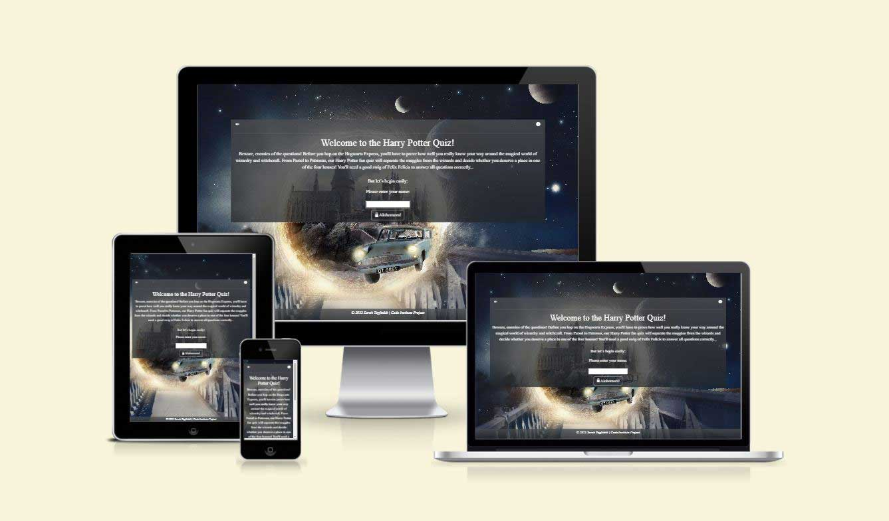

## Features

### Existing features

- __Start screen__
  - This section shows an introduction to the game, an instruction icon which opens an instruction modal by clicking and an audio icon.
  - The user can toggle the audio on or off.
  - The user have to type his/her name into the input field to go further.
  - If the input field is empty or the name has less than 3 characters, an error message is shown.

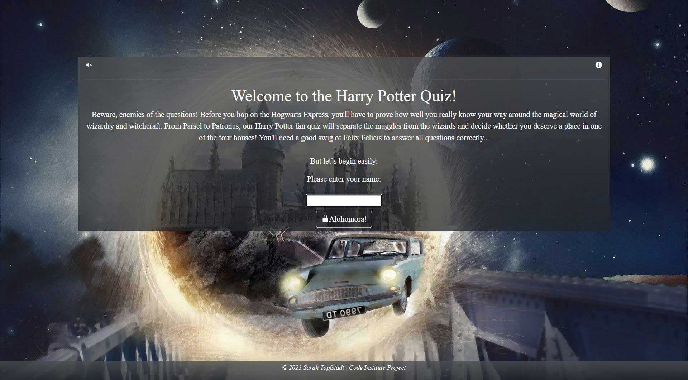
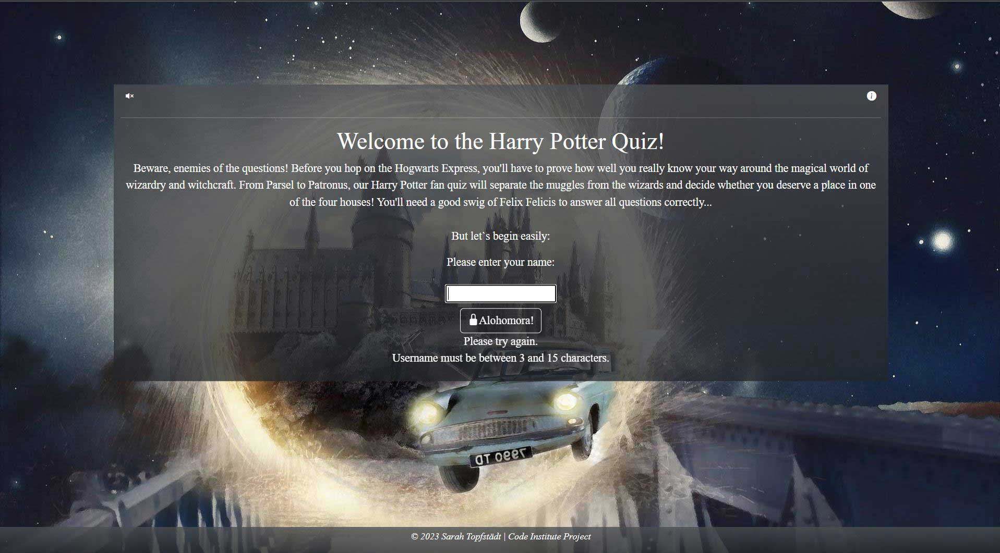

- __Instruction screen__
  - The user can click on the icon to open the instruction modal.
  - The instruction icon appears on the start and level screen.

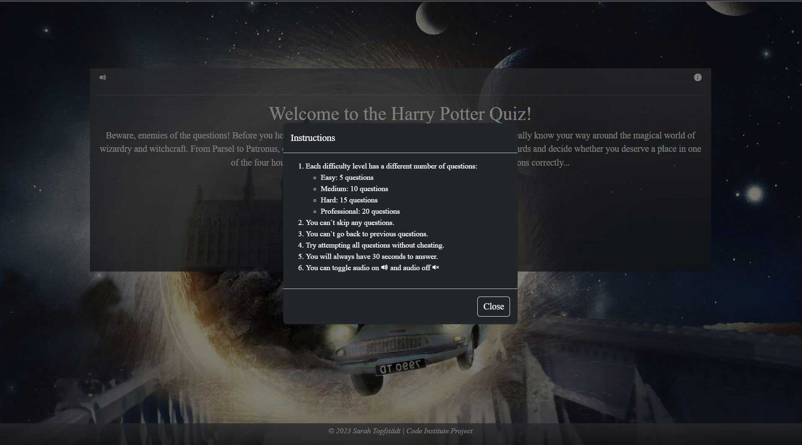

- __Level screen__
  - The user can choose four different levels: Easy, medium, hard or professional.
  - Each level has a different number of questions.
  - The username appears on the top of the section.
  - Also the instruction and audio icon appear.

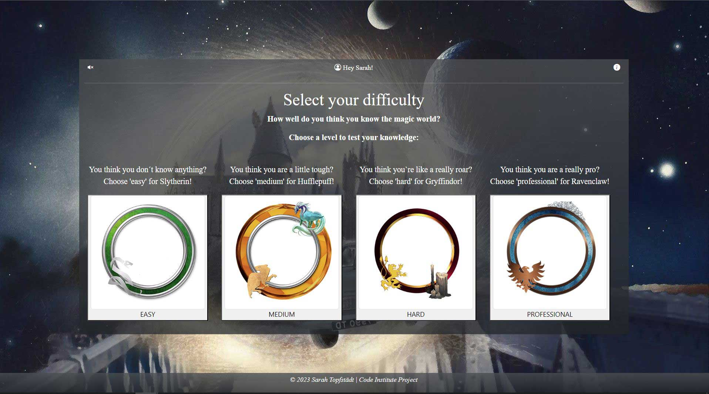

- __Question screen__
  - The question screen shows one question at the time. 
  - Only after clicking on one answer option, the next question button appears.
  - If the answer is correct, the button turns green and the Hogwarts logo appears at the bottom of the section.
  - If the answer is incorrect, the button turns red, the correct answer button turns green and a broken magic wand appears at the bottom of the section.
  - The player will have 30 seconds to answer any question regardless of difficulty level.
  - Time will reset back to 30 seconds upon loading the next question.
  - Time will visibly turn red when the time left is 10 seconds or less.
  - If no answer is chosen and no time left, the correct answer turns green but the image for an incorrect answer appears.
  - The username appears on the top of the section.
  - Also the audio icon appears and a timer.

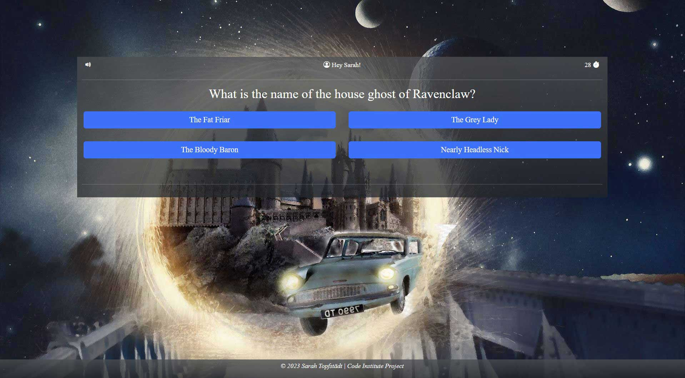
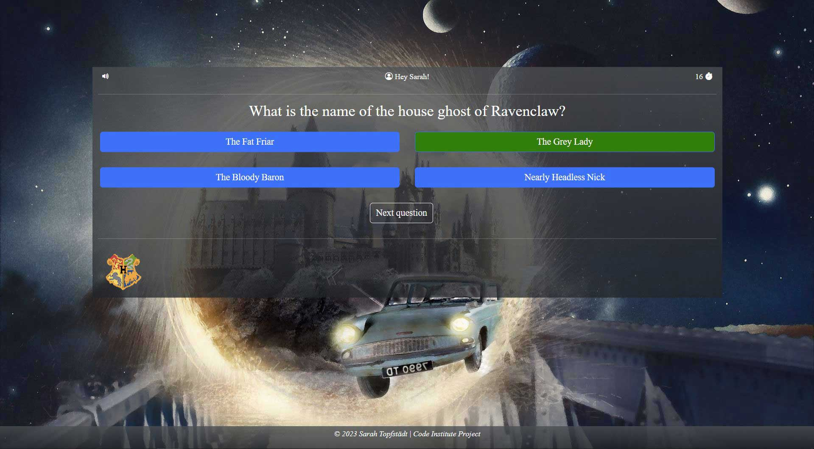
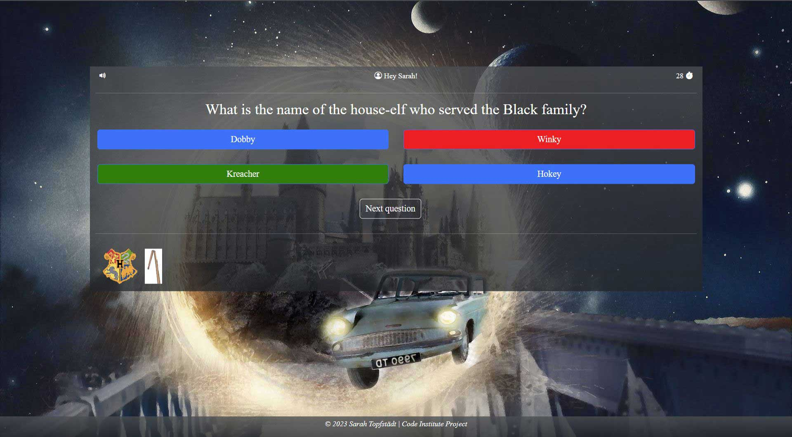

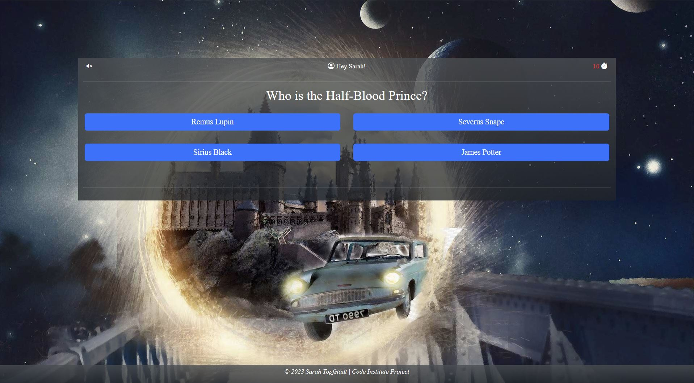

- __End screen__
  - The end screen contains the final score and shows a message and an image.
  - The message and image depend on the final score.
  - There are four messages and images in total.
  - The username appears on the top of the section.
  - Also the audio icon and a try again button appear.

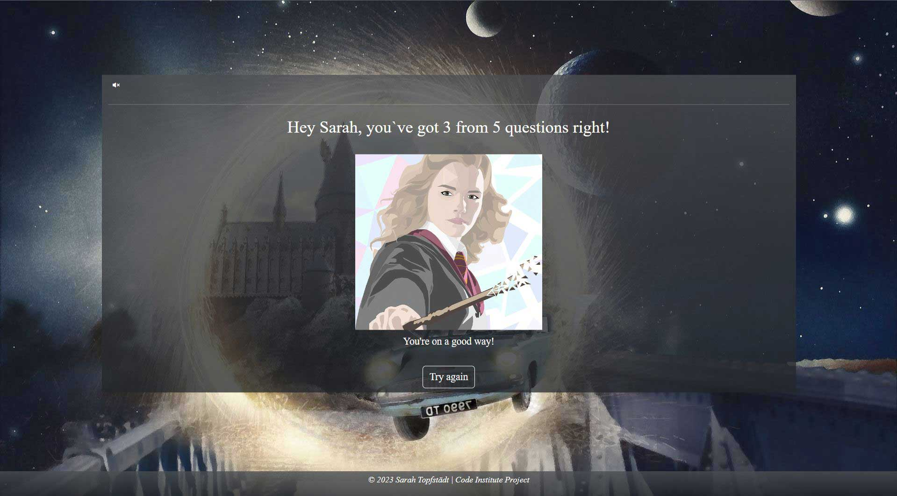

- __Footer section__
  - The footer appears on each section.
  - The footer contains a copyright.

### Features Left to Implement

- There are no features left to implement.

## Technologies used

### Languages used

- HTML5: Provides the content and structure for the website.
- CSS: Provides the styling for the website.
- JavaScript: Provides the functionality of the website.

### Frameworks - Libraries - Programs Used

- [Bootstrap v5.3.0-alpha3](https://getbootstrap.com/docs/5.3/getting-started/introduction/)
  - Bootstrap to use prebuilt grid system and components, like buttons, carousels and nav bars.
- [Git](https://git-scm.com/)
  - Git was used for version control by utilizing the Gitpod terminal to commit to Git and Push to GitHub.
- [Github](https://github.com/)
  - GitHub is used to store the project's code after being pushed from Git.
- [Am I Responsive](http://ami.responsivedesign.is/) 
    - Am I responsive was used to create the multi-device mock-up you can see at the start of this README.md file.
- [Favicon.io](https://favicon.io/)
    - Favicon.io for making the site favicon
- [Chrome dev tools](https://developer.chrome.com/docs/devtools/)
    - Chrome dev tools were used for debugging of the code and check site for responsiveness.
- [WC3 Validator](https://validator.w3.org/), [Jigsaw W3 Validator](https://jigsaw.w3.org/css-validator/) and [JShint](https://jshint.com/) were all used to validate the website.

## Testing

The W3C Markup Validator, W3C CSS Validator and JShint Services were used to validate the pages to ensure there were no syntax errors in the project.

### Validator Testing

- __HTML__
  - No errors were returned when passing through the official [W3C validator](https://validator.w3.org/nu/?showsource=yes&doc=https%3A%2F%2Fpuma13992.github.io%2Fharry-potter-quiz%2F).

- __CSS__
  - No errors were found when copy the styles.css in the official Jigsaw validator but when running the link, some issues showed up from the external library Bootstrap [Results](https://jigsaw.w3.org/css-validator/validator?uri=https%3A%2F%2Fpuma13992.github.io%2Fharry-potter-quiz%2F&profile=css3svg&usermedium=all&warning=1&vextwarning=&lang=de)

- __JS__
  - No errors were found when passing through the official [JS validator](https://jshint.com/).

Google Lighthouse was used to test Performance, Best Practices, Accessibility and SEO on both Desktop and Mobile devices.

The testing was done using the Google Chrome Browser. Chrome Developer Tools was used extensively, particularly to check responsiveness on different screen sizes. Testing was also done using Edge and Firefox on desktop, and again on an iPad Mini and iPhone using Safari.

- Responsive on all device sizes between 280px - 2600px wide
- Devices tested using the Google Developer Tools emulator:
  - iPhone SE (375x667px)
  - iPhone XR (414x896px)
  - iPhone 12 Pro (390x844px)
  - Pixel 5 (393x851px)
  - Samsung Galaxy S8+ (360x740px)
  - Samsung Galaxy S20 Ultra (412x915px)
  - iPad Air (820x1180px)
  - iPad Mini (768x1024px)
  - Surface Pro 7 (912x1368px)
  - Surface Duo (540x720px)
  - Galaxy Fold (280x653px)
  - Samsung Galaxy A15/71 (412x912px)
  - Nest Hub (1024x600px)
  - Nest Hub Max (1280x800px)

- Desktop Results:
  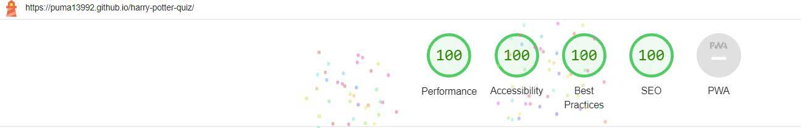
- Mobile Results:
  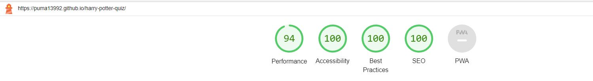

### Unfixed bugs

There are no unfixed bugs.

## Deployment

The website development was created in the "main" branch. This branch was deployed using GitHub Pages.

- This site was deployed by completing the following steps:

1. Open [GitHub](https://github.com/).
2. Click on the project to be deployed.
3. Navigate to the "Settings".
4. Navigate down to the "GitHub Pages".
5. Select the "main" branch and select "Save".
6. The link to the live website was ready on the top.

The live link can be found here - [Live Website](https://puma13992.github.io/harry-potter-quiz/)